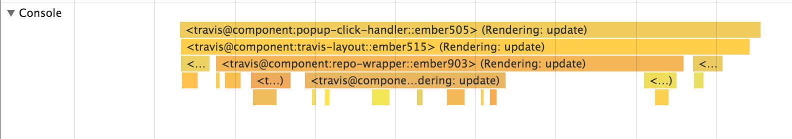
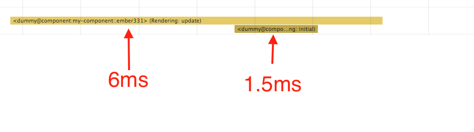
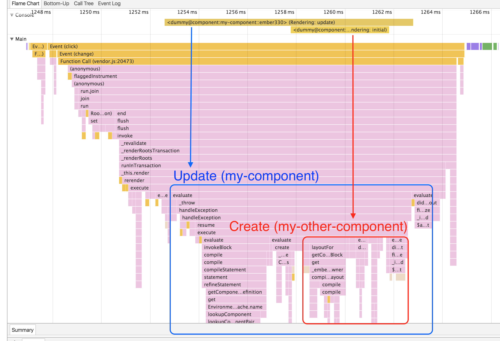
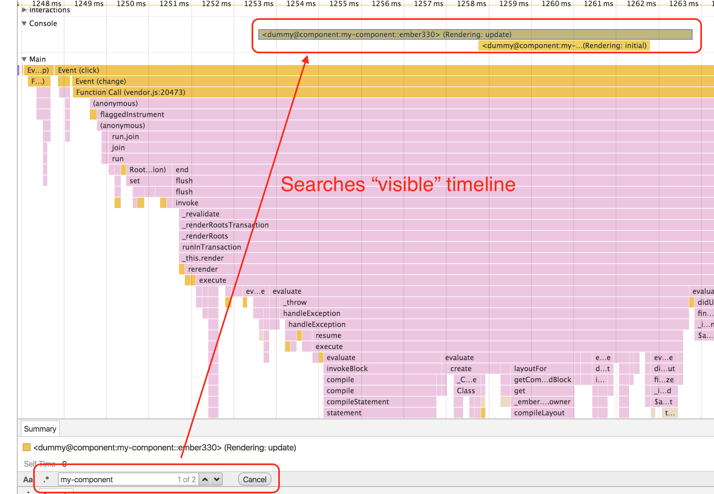

# ember-perf-timeline 

Add performance information to Chrome's Timeline for Ember applications.

Currently this addon provides information for `Component` and `{{outlet}}` render, although more support can (and should) be added in the future.

**Warning: Running with the profiler and instrumentation enabled will itself impede performance itself. Also, be sure to test in production mode or all the development mode assertions will affect performance as well.**

## Installation

* `ember install ember-perf-timeline`

## Usage

1. Add `_ember-perf-timeline=true` to the queryString of your URL.
2. Record a timeline (using either timeline tab or performance tab in Chrome).

*Note: If the query param is not set, the addon will not impact your app's performance, and can be left installed for production. Additionally, if the query param is set, the instrumentation overhead may be non-trivial.*

### Containment

Times for a given component include its own time and those of its children. For the folowing example, the parent component took a total of 6 ms, which includes the 1.5ms of the child:

## Example

1. Run `ember s` in this repo.
2. Visit [http://localhost:4200/?_ember-perf-timeline=true](http://localhost:4200/?_ember-perf-timeline=true).
3. Open "Timeline" or "Performace" tab in the Chrome Developer Tools.
4. Record a timeline.
5. You will see something like:

### What else can you do?

1. You can search by the name of your component:

2. You can search for both `$beforeRenderComponent` and `$afterRenderComponent`, to find the bounds of component renderings within the flame graph:

*Note: Searching is limited to the visibile portion of the timeline.*

# Developement

## Running

* `ember serve`
* Visit your app at [http://localhost:4200](http://localhost:4200).

## Running Tests

* `npm test` (Runs `ember try:each` to test your addon against multiple Ember versions)
* `ember test`
* `ember test --server`

## Building

* `ember build`

For more information on using ember-cli, visit [https://ember-cli.com/](https://ember-cli.com/).
